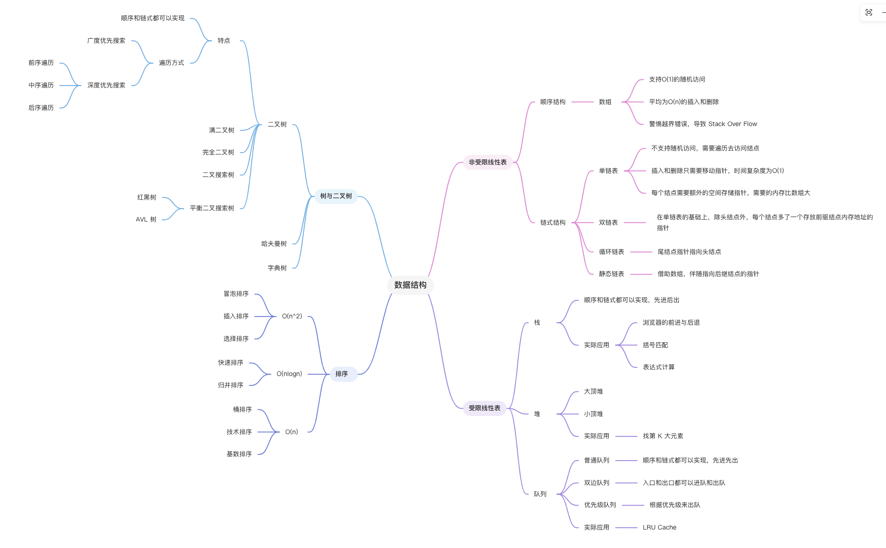
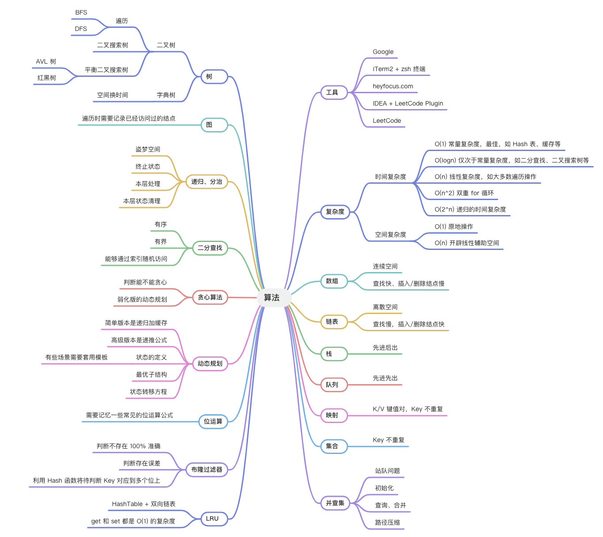
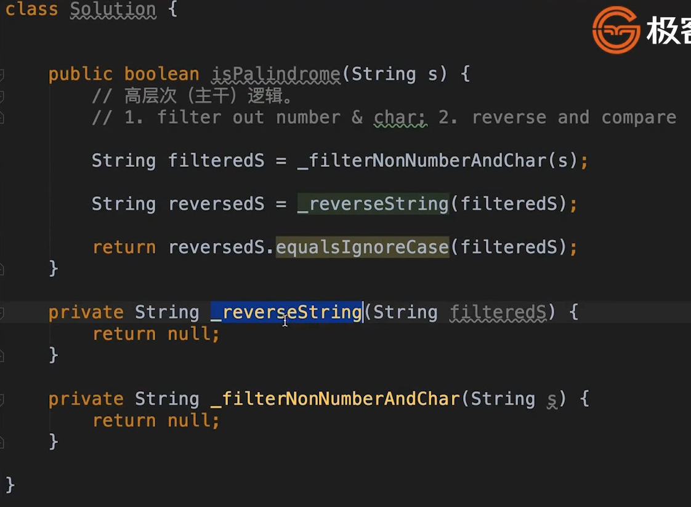

## 精通一个领域

一个方法论，职业训练

> 来自于《异类：不一样的成功启示录》

* chunk it up 切碎知识点，庖丁解牛
  * it is important to view knowleges as sort of a semantic tree（将知识视为一种语义树是很重要的）
  * 将知识变成一棵树状结构，脑图
  * 每一部分单独拎出来专项练习，每个区域的刻意练习。提高水平
* deliberate practicing 刻意练习
   * 5遍刷题法
   * 练习缺陷
   * 不舒服、枯燥
* feedback 反馈
   * 即时反馈
   * 主动型反馈（自己去找）
     * 高手代码（github，LeetCode，etc）
     * 第一视角直播
   * 被动式反馈（高手给你指导）
     * code review
     * 教练看你打，给你反馈

## 数据结构&算法知识脑图

- 数据结构
  - 一维数据结构
    - 基础
      - 数组 array
      - 链表 linked list
    - 高级
      - 栈 stack
      - 队列 queue
      - 双端队列 deque
      - 集合 set
      - 映射 map (hash or map)
      - etc...
  - 二维数据结构
    - 基础
      - 树 tree
      - 图 graph
    - 高级（主要是在树的基础上加了很多特殊判断和约定条件）
      - 二叉搜索树 binary search tree
        - 红黑树 red-black tree
        - AVL
      - 堆 heap
      - 并查集 disjoint set
      - 字典树 trie
      - etc...
  - 特殊数据结构
    - 位运算 Bitwise
      - 布隆过滤器 BloomFilter
    - LRU cache

- 算法
  - 基础（最小重复单元）
    - if-else, switch -> branch
    - for, while loop -> Iteration
    - 递归 Recursion (Divide & Conquer, Backtrace)
  - 高级
    - 搜索 Search
    - 深度优先搜索 DFS
    - 广度优先搜索 BFS
    - 启发式搜索 A*
    - etc
  - 动态规划 Dynamic Programing
  - 二分查找 Binary Search (针对有序的数组进行二分查找)
  - 贪心 Greedy
  - 数学 Math，几何 Geometry

### 参考的脑图
* 
* 

## 刻意练习

基本功的刻意练习

* 基本功是区别业余和职业的根本
* 基础动作的分解训练和反复练习 -> 最大的误区，一个题目只刷一遍

* **刻意练习** - 过遍数（五毒神掌）
* 练习**缺陷**、**弱点**地方
* 感到不舒服、不爽、枯燥（即走出舒适区）

## 反馈

* 即时反馈
* 主动型反馈
* 被动型反馈 

## 刷题方法

五毒神掌，五遍刷题法

### 切题四件套

解题思路

* clarification 多读题目，多和面试官沟通，防止理解错题目
* Possible solutions 找出所有的（尽可能）解法
  * compare(time/space) 比较时间、空间复杂度
  * optimal(加强)
* coding(多写)
* Test cases 测试用例

### 刷题第一遍

* 5分钟：读题+思考
  * 看不懂可延长到10-15
  * 实在无法理解，直接看题解
* 直接看解法：注意！多解法，比较解法优劣
* 背诵、默写好的解法

> PS: 背诵、默写很重要。超过时间都看不懂、没有思路，直接看解法，防止降低刷题的积极性 

### 刷题第二遍

* 马上自己写 -> LeetCode 提交
* 多种解法比较、体会 -> 优化！
  
### 刷题第三遍

* 过了一天后，再重复做题
* 不同解法的熟练程度 -》 专项练习

### 刷题第四遍

* 过了一周：反复回来练习相同题目

### 刷题第五遍

* 面试前一周恢复性练习
  * 时间看自己，提前半个月也可以的

## leetcode

中文网 leetcode-cn
英文网 leetcode

题目上路基是一样的，去掉-cn就可以看到英文版的了

在刷题时，一遍可以中文刷，看题解，注意是要看多个题解，比较优劣
二刷之后，看英文版的discuss-》most votes，找出关于自己语言的题解（前三），全球的高手都在此，更有代表性

## code style

* Goole code style
* Fackbook
* Airbnb

eslint

## 自顶向下的编程方式

《clean code》
* newspaper metaphor: 新闻稿的形式，主干、重要代码放前面，细节放后面。
* learning tests:
* test code as being as important as the actual code

特别是写业务代码

1. 先考虑主干逻辑；
2. 再实现细节 

对于基本功和编程指法的学习，多用google搜索，找最前面的一两篇文章看看。
best practices xxx
top tips