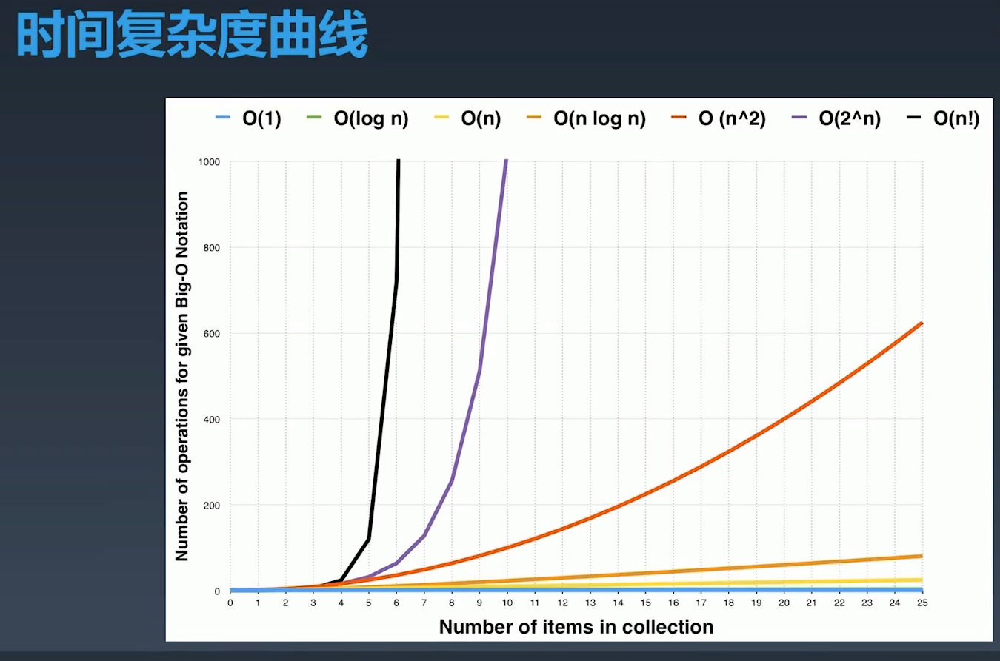
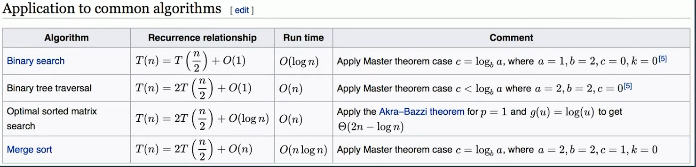

## 时间复杂度

* O(1): 常数复杂度，只执行一次
* O(log n): 对数复杂度
* O(n): 线性时间复杂度，循环执行n次
* O(n^2): 平方
* O(n^3): 立方
* O(2^n): 指数，递归
* O(n!): 阶乘

注意：只看最高复杂度的运算

### 时间复杂度曲线

养成习惯，在写完代码后下意识地分析代码的时间复杂度和空间复杂度。
第二点是，用最简洁的时间和空间复杂度完成这段程序的话，基本上是一个顶尖职业选项的必备素养。

### 对于分析递归的时间复杂度

画出递归树

比如，求斐波那契数列，存在递归公式。
F(n) = F(n-1) + F(n-2) 

如果画出状态树，会发现是一个二叉树，其时间复杂度为O(2^n)，然后存在重复结点，
比如F(0)、F(1)存在多次重复的计算。 

优化
1. 加缓存，保存计算结果
2. 用循环解决

### 主定理

用来计算递归函数的复杂度

### 思考题

* 二叉树遍历 - 前序、中序、后序的时间复杂度是多少？ O(n)
* 图的遍历，时间复杂度是多少？ O(n)
* 搜索算法，DFS、BFS的时间复杂度是多少？ O(n)

通过主定理可以计算得出，更简单的证明是树或者图的结点有且仅有访问一次，因此遍历的时间复杂度
是线性的。

* 二分查找的时间复杂度 O(logn)
