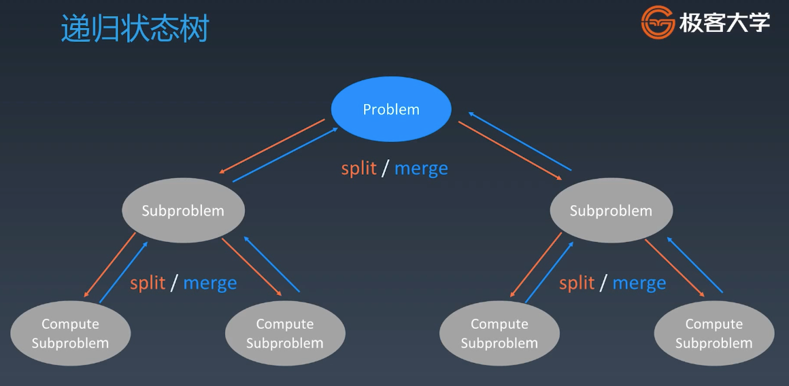

# 分治与递归

分支与递归本质就是递归，递归的一种特殊分类

递归的本质就是找**重复性**，分解子问题，最后组合子问题的结果

PS：计算机程序语言的本身决定的，只有 if else, for loop, recursion



## 分治

Divide & Conquer

### 分治代码模板

```js
// 和泛型递归模板一样，非要说不一样的地方就是要组合子问题的结果

function divideConquer(problem, param1, param2, ...) {
  // recursion terminator
  if (problem is null) {
    consoleTheResult()
    return
  }
  // prepare data
  data = prepareData(data)
  subproblems = splitProblem(problem, data)
  // conquer subproblems
  subresult1 = divideConquer(subproblems[0], p1, p2, ...)
  subresult2 = divideConquer(subproblems[1], p1, p2, ...)
  ...
  // process and generate the final result
  result = processResult(subresult1, subresult2, ...)
  // reverse the current level states if needed
}
```

## 回溯 backtracking

回溯法采用**试错**的思想，他尝试分步地解决一个问题。在分步解决问题的过程中，当它通过尝试发现现有的分步答案不能得到有效的正确的解答的时候，它将取消上一步甚至是上几步的计算，再通过其他的可能的分步解答再次尝试寻找问题的答案。

回溯法通常用最简单的递归方式来实现，在反复重复上述的步骤后可能出现两种情况：

- 找到一个可能存在的正确的答案；
- 在尝试了所有可能的分步方法后宣告该问题没有答案。

在最坏的情况下，回溯法会导致一次复杂度位指数时间的计算。

## 题目

- https://leetcode.cn/problems/generate-parentheses/description/
- https://leetcode-cn.com/problems/powx-n/
- https://leetcode-cn.com/problems/subsets/
- https://leetcode-cn.com/problems/majority-element/description/ （简单、但是高频）
- https://leetcode-cn.com/problems/letter-combinations-of-a-phone-number/
- https://leetcode-cn.com/problems/n-queens/
