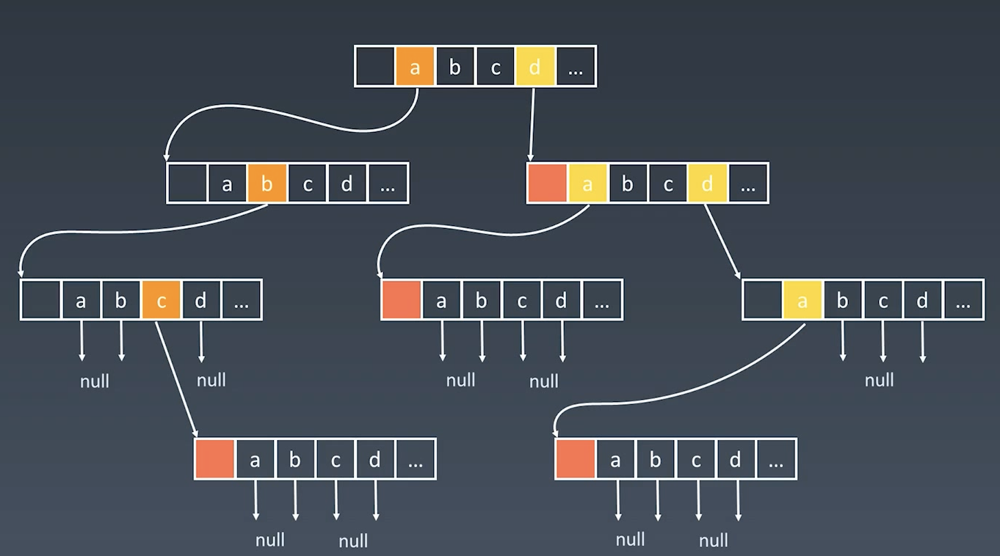

## 字典树 Trie

### 字典树的数据结构

字典树，即Trie树，又称单词查找树或键树或前缀树，是一种树形结构。典型应用是用于统计和排序大量的字符串（但不仅限于字符串）。所以经常被搜索引擎用于文本词频统计。

它的最大优点是：最大限度地减少无谓的字符串比较，查找效率比哈希表高。

（前缀，空间换时间，多叉树）

### 字典树的核心思想

Trie树的核心是空间换时间

利用字符串的公共前缀来降低查询时间的开销以达到提高效率的目的

### 字典树的基本性质 

1. 节点本身不存完整单词
2. 从根节点到某一节点，路径上经过的字符连接起来，为该节点对应的字符串
3. 每个节点的子节点路径代表的字符都不相同

### 节点存储额外信息

如可以存储词频，根据词频可以做推荐等。

### 节点的内部实现



节点内，不再用left,right指向子节点，而是用相应的字符指向

如果只存26字符，不分大小写，那么就是26叉树了，单词的长度就是树的深度

### JS实现
```js
class Trie {
  /**
   * Initialize your data structure here.
   */
  constructor() {
    this.children = {};
  }

  /**
   * Inserts a word into the trie.
   * @param {string} word
   * @return {void}
   */
  insert(word) {
    let node = this.children;
    for (const char of word) {
      if (!node[char]) node[char] = {};
      node = node[char];
    }
    node.isEnd = true;
  }

  /**
   * Return the node if prefix in the trie
   * @param {*} prefix
   * @return {object}
   */
  searchPrefix(prefix) {
    let node = this.children;
    for (const char of prefix) {
      if (!node[char]) return undefined;
      node = node[char];
    }
    return node;
  }

  /**
   * Returns node if the word is in the trie.
   * @param {string} word
   * @return {boolean}
   */
  search(word) {
    const node = this.searchPrefix(word);
    return node !== undefined && node.isEnd === true;
  }

  /**
   * Returns if there is any word in the trie that starts with the given prefix.
   * @param {string} prefix
   * @return {boolean}
   */
  startsWith(prefix) {
    return this.searchPrefix(prefix) !== undefined;
  }
}
```

### 题目

* https://leetcode-cn.com/problems/implement-trie-prefix-tree/solution/
* https://leetcode-cn.com/problems/implement-trie-prefix-tree/#/description
* https://leetcode-cn.com/problems/binary-tree-level-order-traversal/
* https://leetcode-cn.com/problems/word-search-ii/

## 并查集

并查集是一种数据结构，用于处理一些不交集的合并以及查询的问题。

[wiki](https://zh.wikipedia.org/wiki/%E5%B9%B6%E6%9F%A5%E9%9B%86)

### 基本操作

并查集支持的操作有：查询，添加，合并

* makeSet(s): 建立一个新的并查集，其中包含s个单元素集合。(此时x.parent = x)
* unionSet(x,y): 把元素x和元素所在的元素集合合并。要求x和y所在的集合不相交，如果相交则不合并。
* find(x): 找到元素x所在的集合的代表（元素），该操作也可以判断两个元素是否位于同一个集合，只要将它们各自的代表比较一下即可。

```js
/* DisjointSet */
class UnionFind {
  constructor(n) {
    this.count = n;
    // parent 指向自身
    this.parent = new Array(n).fill().map((_, i) => i);
  }

  find(i) {
    let root = i;
    // 找出i对应的代表元素
    while (this.parent[root] !== root) {
      root = this.parent[root];
    }
    // 路径压缩，将集合中的元素直接指向代表元素
    // 这一步没有也可以
    while (this.parent[i] !== i) {
      const x = i;
      i = this.parent[i];
      this.parent[x] = root;
    }
    return root;
  }

  union(i, j) {
    const iRoot = this.find(i);
    const jRoot = this.find(j);
    if (iRoot === jRoot) return;
    // 将其中一个集合的代表指向另一个集合的代表，完成合并
    this.parent[iRoot] = jRoot;
    this.count -= 1;
  }
}
```

### 适用场景

* 组团、配对问题
* Group or not? 判断两个个体是否在一个集合中


### 题目

* https://leetcode-cn.com/problems/friend-circles
* https://leetcode-cn.com/problems/number-of-islands/
* https://leetcode-cn.com/problems/surrounded-regions/
