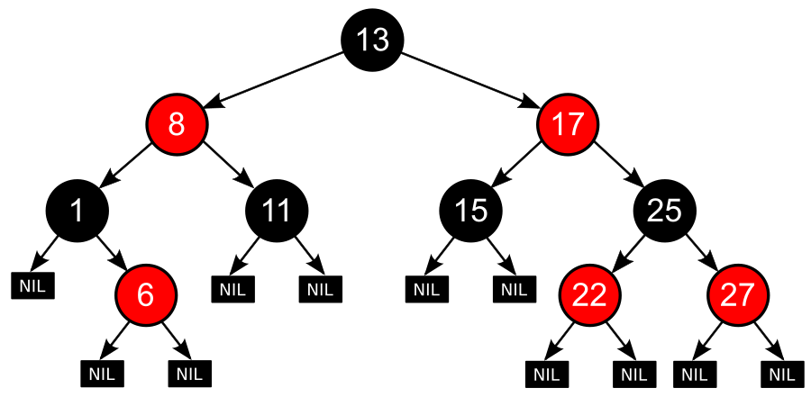
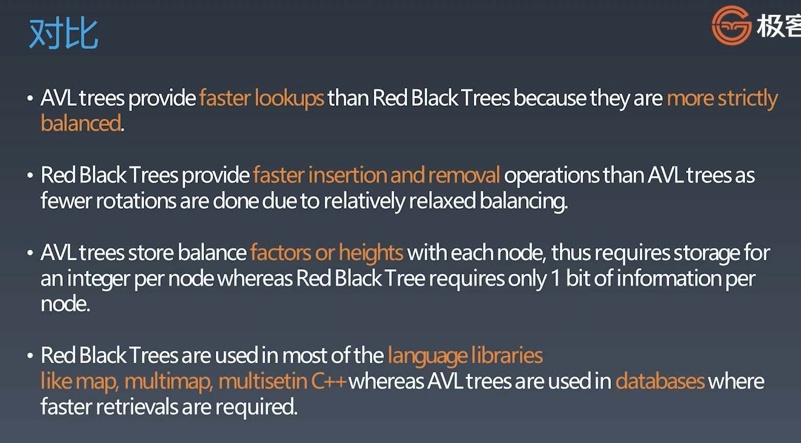

# 红黑树与AVL树

树和链表没有本质上的区别，当一个链表分出两个next的时候，就可以成为树。
它俩数据结构的本质就是一维空间扩散到二维空间

## 二叉搜索树

保证性能的关键

* 保证二维维度 -> 左右子树节点平衡（recursively）
* balanced 平衡
* 引出平衡树

## 平衡树

Self-balancing binary search tree

平衡树是一种改进的二叉搜索树。

平衡指左右子树的高度相似，这样可以保证读取的时间复杂度为O(logn)

假如不控制平衡，二叉树搜索在极端情况下会退化成一个链表，读取变成O(n)

## AVL

AVL树是平衡树的一种实现，最早被发明的平衡树(严格平衡)。在AVL树中，任一节点对应的两棵子树的最大高度差为1，因此它也被称为高度平衡树。查找、插入和删除在平均和最坏情况下的时间复杂度都是`O(logn)`。增加和删除元素的操作则可能需要借由一次或多次树旋转，以实现树的重新平衡。

平衡因子(balance factor)是它左子树的高度减去右子树的高度（有时相反）。带有平衡因子1、0或 -1的节点被认为是平衡的。带有平衡因子 -2或2的节点被认为是不平衡的，并需要重新平衡这个树。平衡因子可以直接存储在每个节点中，或从可能存储在节点中的子树高度计算出来。

（为什么是对比高度，因为二叉搜索树的查询时间与树的高度有关，而不是和节点数量有关）

### 旋转操作

通过旋转来进行平衡，操作有4种：左旋、右旋、左右旋、右左旋


#### 右右子树  =>  左旋

```
A
  \
    B
      \
       C
=>
  B
 / \
A   C
```

#### 左左子树  =>  右旋

```
    C
   /
  B
 /
A
=>
  B
 / \
A   C
```

#### 左右子树  =>  左右旋

其实就是两步操作，先左旋再右旋

```
  C
 /
A
 \
  B
左旋 =>
    C
   /
  B
 /
A
右旋 =>
  B
 / \
A   C
```

#### 右左子树  =>  右左旋

其实就是两步操作，先右旋再左旋

```
A
 \
  C
 /
B
右旋 =>
A
 \
  B
   \
    C
左旋 =>
  B
 / \
A   C
```

### 操作

插入、删除、搜索

### 总结

1. 平衡二叉搜索树
2. 每个节点存balance factor = {-1, 0, 1}
3. 4种旋转操作

不足：节点需要存储额外信息、且调整次数频繁（频繁插入、删除的不适合用AVL树）

## 红黑树（Red-black tree）

红黑树是一种`近似平衡`的二叉搜索树，它能够确保任何一个节点的左右子树的`高度差小于两倍`。具体来说，红黑树是满足如下条件的二叉搜索树：

1. 每个节点是黑色或者红色
2. 根节点是黑色
3. 所有叶子节点是黑色（叶子节点指NIL节点，空节点）
4. **每个红色节点必须有两个黑色的子节点。（从每个叶子到根的所有路径上不能有两个连续的红色节点。）**
5. **从任一节点到其每个叶子的所有简单路径都包含相同数目的黑色节点。**



这些约束确保了红黑树的关键特性：从根到叶子的最长的可能路径不多于最短的可能路径的两倍长。结果是这个树大致上是平衡的。因为操作比如插入、删除和查找某个值的最坏情况时间都要求与树的高度成比例，这个在高度上的理论上限允许红黑树在最坏情况下都是高效的，而不同于普通的二叉查找树。

### 关键性质

从根到叶子的最长的可能路径不多于最短的可能路径的两倍长。

## AVL树与红黑树的对比



简单来说：
* AVL树的查找性能优于红黑树（AVL具有更严格的平衡）；
* 红黑树的插入、删除性能优于AVL树（红黑树只需要更少的旋转操作）；
* AVL树比红黑树更占用内存空间（ALV树每个节点都要存平衡因子，int类型，而红黑树只需要用1bit存颜色信息即可）
* 红黑树更常应用于高级语言的库中（如map，multimap等），而AVL树更常应用于数据库中。

## 资料
* [wiki Self-balancing binary search tree](https://en.wikipedia.org/wiki/Self-balancing_binary_search_tree)
* [AVL树](https://zh.wikipedia.org/wiki/AVL%E6%A0%91)
* [红黑树](https://zh.wikipedia.org/wiki/%E7%BA%A2%E9%BB%91%E6%A0%91)