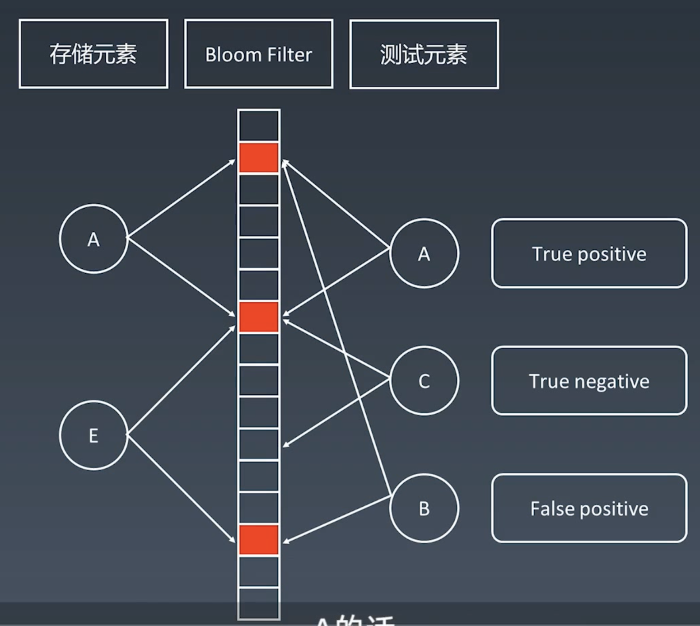

# 布隆过滤器

Bloom Filter

## 哈希表

hash table + 拉链存储重复元素

key 通过哈希函数 转化成下标（index），在对应index存储元素

但是不同的key可能会产生相同的index，也就是哈希碰撞，这时候就需要拉链处理，
变成链表存储内容 

## Bloom Filter vs Hash Table

一个很长的**二进制向量**和一系列**随机映射函数**。布隆过滤器可以用于检索一个元素是否在一个集合中。

优点是空间效率高和查询时间都远远超过一般的算法，

缺点是有一定的误识别率(数组中的1越多，几率越高)和删除困难(一般情况下是不能从Bloom Filter中删除元素的)。

Map不仅可以判断元素是否在其中，而且还可以存储而外的信息。但是布隆过滤器只是用于检索一个元素是否在一个集合中。

**布隆过滤器示意图**

在布隆过滤器中，当一个元素所对应的二进制位的数字都为1，只能判断可能存在。当只要有一个为0，那么就肯定没在集合中。

## 应用

- 比特币网络
- 分布式系统（Map-reduce） -  Hadoop、search engine
- Redis缓存
- 垃圾邮箱、评论等的过滤

布隆过滤器更多是放在最外层当一个缓存使用，用来快速判断元素是否存在，不存在也就无需继续访问。当可能存在时，才会继续去查询如去DB查询

## JS实现

[见文件](../others/bloom-filter.js)

## 资料

- [布隆过滤器(Bloom Filter)的原理和实现](https://www.cnblogs.com/cpselvis/p/6265825.html)
- [使用BloomFilter布隆过滤器解决缓存击穿、垃圾邮件识别、集合判重](https://blog.csdn.net/tianyaleixiaowu/article/details/74721877)
- [Bloom Filters – Introduction and Implementation](https://www.geeksforgeeks.org/bloom-filters-introduction-and-python-implementation/)
- [布隆过滤器 Java 实现示例 1](https://github.com/lovasoa/bloomfilter/blob/master/src/main/java/BloomFilter.java)
- [布隆过滤器 Java 实现示例 1](https://github.com/Baqend/Orestes-Bloomfilter)
- [JS 实现示例 1](https://github.com/jasondavies/bloomfilter.js/blob/master/bloomfilter.js)
- [Bloom Filter in Javascript](https://dev.to/abhinpai/bloom-filter-in-javascript-1efe)
- [hash function](https://en.wikipedia.org/wiki/Hash_function)