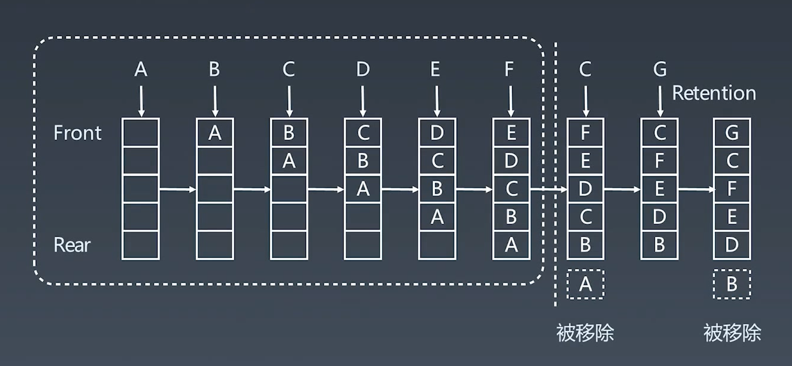

# LRU cache

least recent used 最近最少使用

LRU是一种缓存淘汰策略，选择最近最久未使用的页面予以淘汰。也就是以时间为角度，内存满了就优先删除那些很久没用过的数据。

## Cache 缓存

1. 记忆
2. 钱包 - 储物柜
3. 代码模块
4. 

### cache 替换算法

- LRU 最近最少使用
- LFU 最近最少频次使用
- 。。。

## LRU Cache

- 两个要素：大小、替换策略
- Hash Table + Double LinkedList
- O(1) 查询
  O(1) 修改、更新
  
工作示例

### 设计

| | | |
| -- | -- | -- |
| | LRUCache(capacity) | 开辟一个空间容量为capacity的LRU缓存 |
| void | put(key, val) | 存入键值对 |
| val | get(key) | 获取key对应的val，如果key不存在返回-1 |

要让 put 和 get 方法的时间复杂度为 O(1)，我们可以 总结出 cache 这个数据结构必要的条件:查找快，插入快，删除快，有顺序之分。

什么数据结构同时符合上述条件呢?哈希表查找快，但是数据无固定顺序;链表有顺序之分，插入删除快，但是查找慢。所以结合一下，形成一种新的数据结构:哈希链表。

## 题目

- https://leetcode-cn.com/problems/lru-cache/

## 资料
- [百科](https://baike.baidu.com/item/LRU)
- [Understanding the Meltdown exploit](https://www.sqlpassion.at/archive/2018/01/06/understanding-the-meltdown-exploit-in-my-own-simple-words/)
- [缓存替换算法总揽](https://en.wikipedia.org/wiki/Cache_replacement_policies)