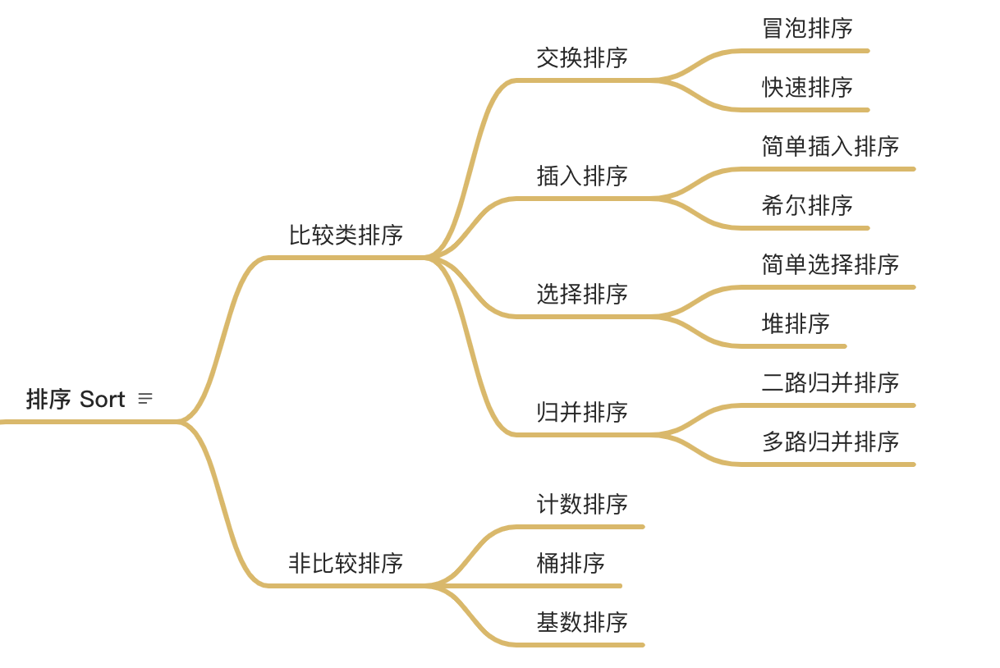

# 排序

## 常用排序分类

- **比较类排序**：通过比较来决定元素间的相对次序，由于其时间复杂度不能突破O(nlogn)，因此也称为非线性时间比较类排序。
- **非比较类排序**：不通过比较来决定元素间的相对次序，它可以突破基于比较排序的时间下界，以线性时间运行，因此也称为线性时


间非比较类排序。

## 常用算法复杂度

| 排序方法 | 时间复杂度(平均) | 时间复杂度O(最坏) | 时间复杂度O(最好) | 空间复杂度 | 稳定性 |
| :-- | :-- | :-- | :-- | :-- | :-- |
| 插入排序 | O(n^2) | O(n^2) | O(n) | O(1) | 稳定 |
| 希尔排序 | O(n^1.3) | O(n^2) | O(n) | O(1) | 不稳定 |
| 选择排序 | O(n^2) | O(n^2) | O(n^2) | O(1) | 不稳定 |
| 堆排序 | O(nlogn) | O(nlogn) | O(nlogn) | O(1) | 不稳定 |
| 冒泡排序 | O(n^2) | O(n^2) | O(n) | O(1) | 稳定 |
| 快速排序 | O(nlogn) | O(n^2) | O(nlogn) | O(nlogn) | 不稳定 |
| 归并排序 | O(nlogn) | O(nlogn) | O(nlogn) | O(n) | 稳定 |
| - |
| 计数排序 | O(n+k) | O(n+k) | O(n+k) | O(n+k) | 稳定 |
| 桶排序 | O(n+k) | O(n^2) | O(n) | O(n+k) | 稳定 |
| 基数排序 | O(n*k) | O(n*k) | O(n*k) | O(n+k) | 稳定 |

PS:
- 稳定：如果a原本在b前面，而a=b，排序之后a仍然在b的前面。
- 不稳定：如果a原本在b的前面，而a=b，排序之后 a 可能会出现在 b 的后面。


## 初级排序 - O(n^2)

1. 选择排序 Selection Sort
   ```
   每次选择最小值，然后放到待排序数组的起始位置。
   重点是每次选择最小
   ```
   
2. 插入排序 Insertion Sort
   ```
   从前到后逐步构建有序序列；对于未排序数据，在已排序数据中从后向前扫描，找到相应位置并插入。
   重点从后往前扫描已排序数据，将新元素插入
   ```
   
3. 冒泡排序 Bubble Sort
   ```
   嵌套循环，每次查看相邻的元素如果逆序，则交换。
   重点是俩俩对比交换
   ```

### [选择排序](https://en.wikipedia.org/wiki/Selection_sort)

```js
/**
 * 选择排序
 * @description
 * ```
 * 1. 比较相邻元素，如果第一个比第二个大，就交换它们两个。
 * 2. 对每一对相邻元素作同样的工作，从开始第一对到结尾的最后一对，这样在最后的元素应该会是最大的数
 * 3. 针对所有的元素重复以上的步骤，除了最后一个
 * 4. 重复步骤1~3，直到排序完成
 * ```
 * @param {array} arr
 * @returns array
 */
function selectionSort(arr) {
  const len = arr.length;
  let minIndex = null;
  for (let i = 0; i < len - 1; i += 1) {
    minIndex = i;
    for (let j = i + 1; j < len; j += 1) {
      // 在未排序区间寻找最小的元素
      if (arr[j] < arr[minIndex]) {
        // 保存最小元素的索引。
        minIndex = j;
      }
    }
    if (minIndex !== i) {
      const temp = arr[i];
      arr[i] = arr[minIndex];
      arr[minIndex] = temp;
    }
  }
  return arr;
}
```

### [插入排序](https://en.wikipedia.org/wiki/Insertion_sort)

```js
/**
 * 插入排序
 * @description
 * ```
 * 它的工作原理是通过构建有序序列，对于未排序数据，在已排序序列中从后向前扫描，找到相应位置并插入。
 * 1. 从第一个元素开始，该元素可以认为已经被排序；
 * 2. 取出下一个元素，在已经排序的元素序列中从后向前扫描；
 * 3. 如果该元素（已排序）大于新元素，将该元素移到下一位置；
 * 4. 重复步骤3，直到找到已排序的元素小于或者等于新元素的位置；
 * 5. 将新元素插入到该位置后；
 * 6. 重复步骤2~5。
 * ```
 * @param {array} arr
 * @returns array
 */
function insertionSort(arr) {
  const len = arr.length;
  for (let i = 1; i < len; i += 1) {
    let preIndex = i - 1;
    const current = arr[i];
    // 已排序数组往后扫描
    // 当前元素和新元素对比
    while (preIndex >= 0 && arr[preIndex] > current) {
      // 当前元素大于新元素，当前元素移动到下一个位置
      arr[preIndex + 1] = arr[preIndex];
      preIndex -= 1;
    }
    arr[preIndex + 1] = current;
  }
}
```

### [冒泡排序](https://en.wikipedia.org/wiki/Bubble_sort)

```js
/**
 * 冒泡排序
 * @description
 * ```
 * 首先在未排序序列中找到最小（大）元素，存放到排序序列的起始位置，
 * 然后，再从剩余未排序元素中继续寻找最小（大）元素，然后放到已排序序列的末尾。
 * 以此类推，直到所有元素均排序完毕。
 * ```
 * @param {array} arr
 * @returns array
 */
function bubbleSort(arr) {
  for (let i = 0; i < arr.length - 1; i += 1) {
    for (let j = 0; j < arr.length - 1 - i; j += 1) {
      // 相邻元素俩俩对比
      if (arr[j] > arr[j + 1]) {
        // 元素交换
        const temp = arr[j];
        arr[j] = arr[j + 1];
        arr[j + 1] = temp;
      }
    }
  }
  return arr;
}
```

## 高级排序 - O(nlogn)

1. 快速排序 Quick Sort
   ```
   数组取基准值pivot，将小元素放在pivot左侧，大元素放在右侧，然后依次对左边和右边的子数组继续快排，
   以达到整个数组有序
   ```
2. 归并排序 Merge Sort
   ```
   运用了分治（Divide and Conquer）
   将已有序的子序列合并，得到完全有序的序列；即先使每个子序列有序，再使子序列段间有序。
   若将两个有序表合并成一个有序表，称为2-路归并。
   ```
3. 堆排序 Heap Sort
   ```
   利用堆这种数据结构所设计的一种排序算法。堆插入O(logn)，取最小/最大值O(1)
   1. 数组元素依次建立小顶堆
   2. 依次取堆顶元素，并删除
   ```

快排和归并具有相似性，但步骤相反：

归并：先排序左右子数组，然后合并两个有序子数组
快排：先调配出左右子数组，然后对左右子数组进行排序

### [快速排序](https://en.wikipedia.org/wiki/Quicksort)

### [归并排序](https://en.wikipedia.org/wiki/Merge_sort)

### [堆排序](https://en.wikipedia.org/wiki/Heapsort)

## 特殊排序 - O(n)

1. [计数排序 Counting Sort](https://en.wikipedia.org/wiki/Counting_sort)
   ```
   计数排序不是基于比较的排序算法，其核心在于将输入的数据值转化为键存储在额外开辟的数组空间中。 作为一种线性时间复杂度的排序，计数排序要求输入的数据必须是有确定范围的整数。
   ```
2. [桶排序 Bucket Sort](https://en.wikipedia.org/wiki/Bucket_sort)
   ```
   桶排序是计数排序的升级版。它利用了函数的映射关系，高效与否的关键就在于这个映射函数的确定。桶排序 (Bucket sort)的工作的原理：假设输入数据服从均匀分布，将数据分到有限数量的桶里，每个桶再分别排序（有可能再使用别的排序算法或是以递归方式继续使用桶排序进行排）。
   ```
3. [基数排序 Radix Sort](https://en.wikipedia.org/wiki/Radix_sort)
   ```
   基数排序是按照低位先排序，然后收集；再按照高位排序，然后再收集；依次类推，直到最高位。有时候有些属性是有优先级顺序的，先按低优先级排序，再按高优先级排序。最后的次序就是高优先级高的在前，高优先级相同的低优先级高的在前。
   ```


## 题目

* https://leetcode-cn.com/problems/relative-sort-array/
* https://leetcode-cn.com/problems/valid-anagram/
* https://leetcode-cn.com/problems/design-a-leaderboard/
* https://leetcode-cn.com/problems/merge-intervals/
* https://leetcode-cn.com/problems/reverse-pairs/
* 逆序对


## 资料

- [十大经典排序算法（动图演示）](https://www.cnblogs.com/onepixel/p/7674659.html)
- [9 种经典排序算法可视化动画](https://www.bilibili.com/video/av25136272)
- [6 分钟看完 15 种排序算法动画展示](https://www.bilibili.com/video/av63851336)