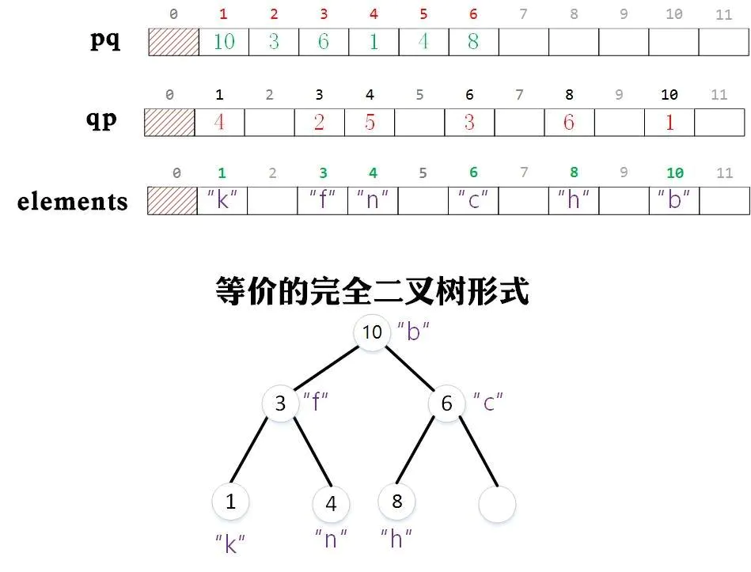

# 优先队列 Priority Queues

## 定义

摘抄自wiki

> 优先队列是计算机科学中的一类抽象数据类型。优先队列中的每个元素都有各自的优先级，优先级最高的元素最先得到服务；优先级相同的元素按照其在优先队列中的顺序得到服务。优先队列往往用堆来实现。

优先队列支持两种操作：删除最大/最小值和插入（还有查看最大/最小值）。分别对应最大优先队列，最小优先队列

最大优先队列的API的设计如下

## 实现

### 初级实现

可用数组，链表实现

* 有序数组实现：插入O(n)，取出O(1)
* 无序数组实现：插入O(1)，取出O(n)
* 链表实现

### 典型实现

优先队列往往是用堆来实现的

### [二叉堆](./二叉堆.md)

二叉堆为一种特殊的二叉树。二叉堆分为最大堆，和最小堆。

最大堆的性质是：每个节点都大于等于它的两个子节点

最小堆的性质：每个节点都小于等于它的两个子节点

二叉堆的删除和插入时间复杂度为O(logn)

### 具体实现

* [最大优先队列](../others/pq/MaxPQ.js)
* [最小优先队列](../others/pq/MinPQ.js)
* [索引最大优先队列](../others/pq/IndexMaxPQ.js)
* [索引最小优先队列](../others/pq/IndexMinPQ.js)

## 索引优先队列

优先队列有一个缺点，就是不能直接访问已存在于优先队列中的对象，并更新它们。

索引优先队用一个整数和对象进行关联，当我们需要更新该对象的值时，可以通这个整数进行快速索引，然后对对象的值进行更新（简而言之，用一个索引数组保存了对象在数组中的位置）。当然更新后的对象在优先队列中的位置可能发生变化，这样以保证整个队列还是一个优先队列。

### 实现原理

`keys`存放对象，`pq`存放与对象相关的整数，也就是对象在数组中的位置。
`qp`存储与对象相关的整数在`pq`数组中的下标，目的是为了在修改`k`对应的对象时，能够快速找到pq中元素值对应的下标，同时在上浮/下沉的过程中同时维护它。

`keys`存放的对象不一定在数组中是连续存放的，`qp`同`keys`。`pq`是连续存放的，且作为优先队列，是需要通过swim/sink维护堆有序的。
在维护堆有序时，`keys`是不需要修改的，需要修改`pq`，`qp`

## 资料

* [wiki](https://zh.wikipedia.org/wiki/%E5%84%AA%E5%85%88%E4%BD%87%E5%88%97)
* [算法 优先队列](https://algs4.cs.princeton.edu/24pq/)
* [索引优先队列](https://www.cnblogs.com/nullzx/p/6624731.html)
* [数据机构与算法--索引优先队列](https://www.jianshu.com/p/e13406ae5b1b)